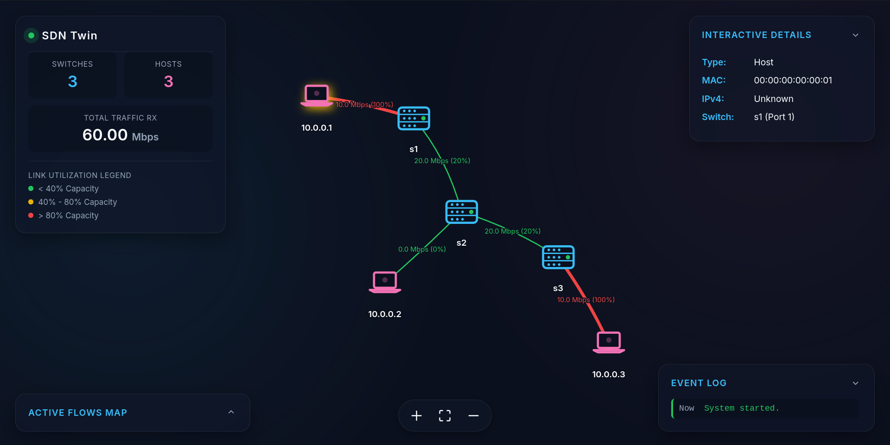
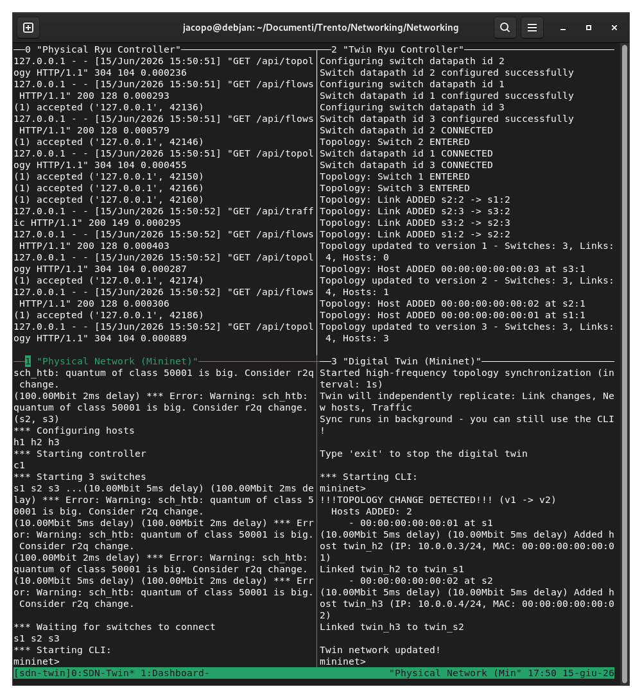

# Hybrid Digital Twin for SDN Networks

A fully automated system that generates a real-time **Digital Twin** of an SDN network. The twin replicates the physical topology, mirrors traffic loads, and visualizes everything through an interactive web dashboard with live traffic heatmaps.



The system exploits the **Ryu Northbound REST API** to retrieve topology and traffic information from the physical network, and automatically reproduces any runtime change into the Digital Twin.

---

## Table of Contents

- [Architecture](#architecture)
- [Features](#features)
- [Project Structure](#project-structure)
- [Prerequisites](#prerequisites)
- [Setup](#setup)
  - [1. System Dependencies](#1-system-dependencies)
  - [2. Docker Image for Ryu (Required)](#2-docker-image-for-ryu-required)
  - [3. Python Dependencies](#3-python-dependencies)
- [Execution](#execution)
  - [Step 1 — Start the Physical Network](#step-1--start-the-physical-network)
  - [Step 2 — Start the Physical Ryu Controller](#step-2--start-the-physical-ryu-controller)
  - [Step 3 — Start the Twin Ryu Controller](#step-3--start-the-twin-ryu-controller)
  - [Step 4 — Start the Digital Twin](#step-4--start-the-digital-twin)
  - [Step 5 — Start the Web Dashboard](#step-5--start-the-web-dashboard)
- [Testing and Demonstration](#testing-and-demonstration)
  - [Basic Connectivity](#basic-connectivity)
  - [Traffic Generation and Heatmap](#traffic-generation-and-heatmap)
  - [Dynamic Topology Changes](#dynamic-topology-changes)
- [Architecture Details](#architecture-details)
  - [IP Translation (Namespace Isolation)](#ip-translation-namespace-isolation)
  - [Traffic Monitoring and Emulation](#traffic-monitoring-and-emulation)
  - [Real-Time Dashboard](#real-time-dashboard)
- [REST API Reference](#rest-api-reference)
- [Troubleshooting](#troubleshooting)

---

## Architecture

```
┌────────────────────────────────────────────────────────────────────┐
│                        Linux Host Machine                          │
│                                                                    │
│  ┌────────────────────────┐    ┌────────────────────────────────┐  │
│  │   Physical Network     │    │        Digital Twin            │  │
│  │    (CPU Cores 0,1)     │    │       (CPU Cores 2,3)          │  │
│  │                        │    │                                │  │
│  │  h1 ── s1 ── s2 ── s3  │    │  th1 ── ts1 ── ts2 ── ts3      │  │
│  │        │         │     │    │         │           │          │  │
│  │       h2        h3     │    │        th2         th3         │  │
│  └───────────┬────────────┘    └──────────────┬─────────────────┘  │
│              │                                │                    │
│       ┌──────┴──────┐                  ┌──────┴──────┐             │
│       │ Phys Ryu #1 │                  │ Twin Ryu #2 │             │
│       │ (Cores 0,1) │                  │ (Cores 2,3) │             │
│       │ Port 6633   │                  │ Port 6634   │             │
│       │ API: 8080   │                  │ API: 8081   │             │
│       └──────┬──────┘                  └─────────────┘             │
│              │                                ▲                    │
│              │       ┌────────────────┐       │                    │
│              ├──────►│   Twin Engine  ├───────┘                    │
│              │       │  (Cores 2,3)   │                            │
│              │       │  ETag Polling  │                            │
│              │       └────────────────┘                            │
│              │                                                     │
│       ┌──────┴──────┐                                              │
│       │  Dashboard  │  ◄── Fetches /api/topology + /api/traffic    │
│       │  Flask:5000 │                                              │
│       └─────────────┘                                              │
└────────────────────────────────────────────────────────────────────┘
```

---

## Features

| Feature | Description |
|---|---|
| **Automated Topology Replication** | Fetches real-time switch, link, and host data via Ryu REST API and builds an identical Mininet clone |
| **Shadow Controller Mirroring** | Twin switches connect to their own isolated Twin Ryu Controller. This provides true Control-Plane autonomy, allowing the Twin to independently process Packet-In events while inheriting physical routing policy via shared volume mounts. |
| **IP & MAC Fidelity** | The twin uses identically sorted MACs and IP addresses (`10.0.0.x`), leveraging strict Mininet network namespaces for 100% data-plane replication accuracy. |
| **Hardware Isolation** | Employs `cgroups` (`--cpuset-cpus` and `taskset`) to physically partition CPU cores, preventing Twin traffic emulation from causing context-switching latency in the Physical network (solving the "Observer Effect"). |
| **Flow-Based Emulation** | Detects active IP flows >1 Mbps and auto-spawns exact `iperf3` client/server replicas between twin hosts. Emulation is restricted to the Top 5 heaviest flows to protect host CPU limits. |
| **High-Frequency ETag Telemetry** | Twin Engine independently runs a decoupled 1-second polling loop using `304 Not Modified` ETag caching to detect topology changes instantly with near-zero overhead. |
| **Web Dashboard** | Real-time WebSocket (Socket.IO) dashboard with dark mode glassmorphism, interactive nodes, live event logs, active flows table, and traffic heatmaps. |
| **Bearer Authentication** | Enforces secure access for all Northbound REST API endpoints, the dashboard, and external twin integrations |
| **Emulation Capacity Caps** | Intelligently limits `iperf3` concurrent flow emulation to only the Top N heaviest flows to protect host CPU and prevent namespace resource starvation |
| **Teardown Orchestration** | Strict shutdown sequence that explicitly detects and kills all trailing user-space daemons (`iperf3`), containers, and Mininet artifacts on exit |

---

## Project Structure

```
.
├── src/
│   ├── network/
│   │   └── net.py             # Physical network topology (Mininet)
│   ├── controller/
│   │   ├── api.py             # WSGI REST API endpoints
│   │   └── ryu_app.py         # Core OpenFlow Ryu SDN controller
│   ├── twin/
│   │   ├── api_client.py      # REST API communication client
│   │   ├── engine.py          # Twin orchestration engine
│   │   ├── main.py            # Digital Twin launcher
│   │   └── topology.py        # Mininet topology generation
│   └── dashboard/
│       ├── app.py             # Flask web server for dashboard
│       ├── poller.py          # Background Ryu API polling thread
│       ├── utils.py           # Topology diffing and event logic
│       ├── static/            # Static web assets
│       └── templates/         # HTML templates
├── Dockerfile.ryu             # Docker image for running Ryu on modern systems
├── start.sh                   # Launcher script (Tmux + Docker orchestration)
└── README.md                  # This file
```

### File Descriptions

- **`src/network/net.py`** — Defines the physical SDN network: 3 switches in a linear topology (`s1-s2-s3`), each with one host (`h1`, `h2`, `h3`). Connects to a remote Ryu controller on port `6633`.

- **`src/controller/ryu_app.py` & `api.py`** — A modular Ryu OpenFlow 1.3 controller implementing:
  - L2 learning switch with ARP flood handling
  - Topology discovery via `ryu.topology` events
  - Real-time port statistics polling (`OFPPortStatsRequest`)
  - REST API endpoints via `api.py`: `/api/topology`, `/api/switches`, `/api/links`, `/api/hosts`, `/api/traffic`, `/api/version`

- **`src/twin/` Modules** — The main Digital Twin engine:
  - `api_client.py` fetches the physical topology via ETag-cached REST API
  - `topology.py` builds an isolated Mininet replica natively bound to a Shadow Controller
  - `engine.py` runs an independent 1-second background telemetry loop handling topology and flow updates
  - `main.py` serves as the CLI launcher

- **`src/dashboard/` Modules** — The Flask application components:
  - `poller.py` manages background threads fetching Ryu data via API and streaming over WebSocket.
  - `utils.py` compares topological states for live event alerts.
  - `app.py` serves the web dashboard endpoints.

- **`src/dashboard/templates/index.html`** — Stunning Glassmorphic Dark Mode visualization using [vis-network](https://visjs.github.io/vis-network/docs/network/). Edges are dynamically colored:
  - 🟢 Green: < 40% Link Utilization
  - 🟡 Yellow: 40% - 80% Link Utilization
  - 🔴 Red: > 80% Link Utilization

- **`start.sh`** — Automated orchestration script leveraging Tmux and CPU Pinning (`taskset`/`--cpuset-cpus`) to launch all 5 components in strictly isolated hardware constraints.

---

## Prerequisites

| Requirement | Purpose |
|---|---|
| **Linux** (Debian/Ubuntu recommended) | Mininet requires Linux kernel network namespaces |
| **Mininet** | Virtual network emulation |
| **Open vSwitch** | OpenFlow-compatible virtual switches |
| **Docker** | Runs the Ryu controller in an isolated Python 3.9 environment |
| **iperf3** | Traffic generation for load emulation |
| **Python 3** (system) | Runs `net.py`, `twin.py`, and `dashboard.py` natively |
| **Flask** | Web dashboard backend |

> **Why Docker?** The Ryu SDN framework was abandoned in 2017 and is incompatible with Python ≥ 3.12 due to removed `distutils` and `setuptools` internals. Docker isolates Ryu in a Python 3.9 container while the rest of the project runs natively.

---

## Setup

### 1. System Dependencies

```bash
sudo apt update
sudo apt install -y mininet openvswitch-switch iperf3 docker.io
```

Start the Open vSwitch service:

```bash
sudo service openvswitch-switch start
```

Ensure your user can run Docker (or use `sudo`):

```bash
sudo usermod -aG docker $USER
# Log out and back in for this to take effect, or use sudo for docker commands
```

### 2. Docker Image for Ryu (Required)

Build the custom Ryu Docker image. This only needs to be done **once**:

```bash
sudo docker build -t my-ryu -f Dockerfile.ryu .
```

This creates a lightweight image (~250 MB) with Python 3.9, a compatible `setuptools`, `eventlet==0.30.2`, and `ryu==4.34`.

### 3. Python Dependencies

Install Flask for the dashboard (in a virtual environment or system-wide):

```bash
# Option A: Using a virtual environment
python3 -m venv venv
./venv/bin/pip install flask

# Option B: System-wide
pip3 install flask
```

The Mininet Python library is installed system-wide by the `mininet` apt package; it does **not** need to be installed via pip.

---

## Execution

### Automated Launch (Recommended)

The easiest way to run the entire project is using the automated `start.sh` script, which orchestrates all 5 components in a single `tmux` session with split panes.



```bash
sudo ./start.sh
```

This will automatically:
1. Check dependencies.
2. Build the Docker image if missing.
3. Clean up any stale Mininet/Ryu instances.
4. Launch the physical network, both controllers, the twin engine, and the dashboard in separate tmux panes.

To detach from the tmux session, press `Ctrl+B` then `d`.
To re-attach, run `tmux attach -t sdn-twin`.
To stop everything, run `sudo ./start.sh --stop`.

### Manual Execution

If you prefer to run things manually, open **5 separate terminal windows/tabs** and run the commands in the following order.

### Step 1 — Start the Physical Network

```bash
sudo python3 src/network/net.py
```

Wait for the `mininet>` prompt to appear. This means the 3 switches and 3 hosts are running.

### Step 2 — Start the Physical Ryu Controller

```bash
sudo docker run -it --network host -v $(pwd):/app -w /app my-ryu ryu-manager --observe-links src/controller/ryu_app.py
```

You should see log messages like:
```
Switch datapath id 1 CONNECTED
Switch datapath id 2 CONNECTED
Switch datapath id 3 CONNECTED
```

### Step 3 — Start the Digital Twin

```bash
sudo python3 src/twin/main.py --sync
```

The `--sync` flag enables continuous background synchronization (topology discovery, dynamic link stitching, and control-plane mirroring).

You should see:
```
Fetching topology from http://localhost:8080
Topology fetched successfully (version X)
Switches: 3, Links: 4, Hosts: 3
Building digital twin topology...
Started topology synchronization (interval: 10s)
```

### Step 4 — Start the Web Dashboard

```bash
cd src/dashboard && python3 app.py
# Or, if using a virtual environment:
cd src/dashboard && ../../venv/bin/python3 app.py
```

If you use `start.sh`, the dashboard will automatically open in your browser when ready. Otherwise, open your browser and navigate to: **http://localhost:5000**

---

## Testing and Demonstration

### Basic Connectivity

In **Terminal 1** (physical network's `mininet>` prompt):

```bash
mininet> pingall
```

This discovers all hosts in the topology. Go back to the **Dashboard** — you should see all 3 switches and 3 hosts rendered as an interactive graph.

In **Terminal 3** (twin network's `mininet>` prompt):

```bash
mininet> pingall
```

Verify that the Digital Twin also has full connectivity between its hosts using the identical `10.0.0.x` IP addresses.

### Traffic Generation and Heatmap

In **Terminal 1** (physical network):

```bash
mininet> iperf h1 h2
```

This generates a burst of TCP traffic between `h1` and `h2`. After ~5 seconds:

1. **Dashboard**: The edges between the involved switches will turn **yellow** or **red**, and the traffic labels will show the Mbps values. The Active Flows table will list the `10.0.0.1 -> 10.0.0.2` flow.

2. **Twin** (Terminal 3): The sync loop will clone the OpenFlow traffic rules allowing packets to pass, and spawn `iperf3` client-server processes inside the twin hosts to replicate the physical bandwidth load.

**Important:** For sustained traffic that shows the heatmap change in real time, you must start an `iperf` TCP server listener on the destination host before running the client:

```bash
mininet> h2 iperf -s -D
mininet> h1 iperf -c 10.0.0.2 -t 30 &
```

### Dynamic Topology Changes

To demonstrate live topology synchronization, take down a link in the physical network:

```bash
mininet> link s1 s2 down
```

Within 10 seconds, the Twin (Terminal 4) will print:
```
!!!TOPOLOGY CHANGE DETECTED!!! (vX -> vY)
Links REMOVED: 1
     - s1 <-> s2
Brought down link twin_s1 <-> twin_s2
Twin network updated!
```

Restore the link:

```bash
mininet> link s1 s2 up
```

The twin will detect and replicate this change as well.

### Dynamically Adding Nodes

To test the Twin's ability to mirror brand new infrastructure dynamically, you can create new switches and hosts at runtime in the physical Mininet CLI. 

Because Open vSwitch port numbering must remain perfectly synchronized with Mininet's internal Python state, you must execute these commands via the Python API (`py`) rather than raw bash `sh ovs-vsctl` hacks.

Copy and paste this exact block of commands into the **Physical Network** terminal:

```python
py net.addSwitch('s4', dpid='0000000000000004')
py net.addHost('h4', ip='10.0.0.4/24', mac='00:00:00:00:00:04')
py net.addLink(net.get('s2'), net.get('s4'))
py net.addLink(net.get('h4'), net.get('s4'))
py net.get('s4').start([net.get('c1')])
py net.get('s2').attach(net.get('s2').intfList()[-1])
py net.get('h4').configDefault()
py net.get('h4').cmd('ping -c 1 10.0.0.1 &')
```

Within a second, the Digital Twin will instantly intercept the new OpenFlow connections, detect the new MAC and DPID via its background ETag polling, and flawlessly mirror `s4` and `h4` into its own isolated namespace!

---

## Architecture Details

### Namespace Isolation (Packet Fidelity)

To act as a true Digital Twin, the replicated network must use the exact same IP and MAC addresses as the physical network. 

Because Mininet strictly isolates hosts inside Linux Network Namespaces (`netns`), the kernel flawlessly manages both the physical hosts (`h1`, `10.0.0.1`) and the twin hosts (`twin_h1`, `10.0.0.1`) simultaneously without routing conflicts or ARP poisoning. 

| Property | Physical Network | Digital Twin |
|---|---|---|
| IP Range | `10.0.0.x/24` | `10.0.0.x/24` |
| MAC Prefix | `00:00:00:00:00:xx` | identically mapped |
| Switch Names | `s1`, `s2`, `s3` | `twin_s1`, `twin_s2`, `twin_s3` |
| Port Mappings| e.g. `s1-eth2` | `twin_s1-eth2` (Strict Fidelity) |
| Flow Tables  | Installed by Ryu | Mirrored via `ovs-ofctl` |

### Traffic Monitoring and Emulation

The Ryu controller periodically sends both `OFPPortStatsRequest` and `OFPFlowStatsRequest` messages to all connected switches. When a reply arrives, it tracks active connections based on source/destination IPv4 addresses, computing accurate Mbps through exact time deltas. 

The twin's sync loop reads this generated flow matrix via `/api/flows`. When physical end-to-end IP flows exhibit >1 Mbps throughput, the twin dynamically provisions corresponding `iperf3` processes on the mirrored twin hosts:

```bash
# Destination Twin Host runs the daemon natively
mininet> target_twin_host iperf3 -s -D

# Source Twin Host natively replicates the identical load
mininet> source_twin_host iperf3 -c {target_twin_IP} -u -b {Mbps}M -t {SYNC_INTERVAL} &
```

This ensures zero duplicate packet counting and establishes a perfectly accurate L3 flow replication network.

### Real-Time Dashboard

The Flask backend (`dashboard.py`) functions as a persistent **WebSocket (Socket.IO)** stream. It passively polls the Ryu REST APIs and instantly pushes state changes up to the client browsers:

1. Connects clients via WebSocket instead of legacy HTTP fetching.
2. Updates interactive nodes allowing users to click devices to pop out an **Interactive Sidebar Dashboard** for port logs, mappings, and byte counts.
3. Automatically computes topology `diffs` turning into **Live Event Console Logs**: `Switch disconnected`, `Host e6 joined`, `Link cut`.
4. Renders dynamic active flow charts detailing exactly `who` is talking to `who`, instantly synced from controller API values.

---

## REST API Reference

All endpoints are served by the Ryu controller on port `8080` (physical) or `8081` (twin).

| Method | Endpoint | Description |
|---|---|---|
| `GET` | `/api/topology` | Full topology: switches, links, hosts, version counter |
| `GET` | `/api/switches` | List of switches with DPID and port numbers |
| `GET` | `/api/links` | List of inter-switch links with src/dst DPID and port |
| `GET` | `/api/hosts` | Discovered hosts with MAC, IPv4, IPv6, and attachment point |
| `GET` | `/api/traffic` | Per-port Rx/Tx Mbps for each switch |
| `GET` | `/api/flows` | Active IP-to-IP tracking arrays detailing traffic bandwidth inside the SDN |
| `GET` | `/api/version` | Current topology version number |

### Example Response — `/api/topology`

```json
{
  "switches": {
    "1": { "dpid": 1, "ports": [1, 2] },
    "2": { "dpid": 2, "ports": [1, 2, 3] },
    "3": { "dpid": 3, "ports": [1, 2] }
  },
  "links": [
    { "src_dpid": 1, "src_port": 2, "dst_dpid": 2, "dst_port": 1 },
    { "src_dpid": 2, "src_port": 3, "dst_dpid": 3, "dst_port": 2 }
  ],
  "hosts": {
    "00:00:00:00:00:01": { "mac": "00:00:00:00:00:01", "ipv4": "10.0.0.1", "dpid": 1, "port": 1 }
  },
  "version": 5
}
```

### Example Response — `/api/traffic`

```json
{
  "1": {
    "1": { "rx_mbps": 0.0012, "tx_mbps": 0.0008 },
    "2": { "rx_mbps": 4.2351, "tx_mbps": 4.1923 }
  }
}
```

---

## Troubleshooting

| Problem | Solution |
|---|---|
| `ModuleNotFoundError: No module named 'mininet'` | Install Mininet system-wide: `sudo apt install mininet` |
| `Cannot find required executable mnexec` | Mininet is not properly installed: `sudo apt install mininet` |
| `ovs-vsctl: not found` | Install Open vSwitch: `sudo apt install openvswitch-switch` and start it: `sudo service openvswitch-switch start` |
| Docker build fails with TLS timeout | Network issue; retry: `sudo systemctl restart docker && sudo docker build -t my-ryu -f Dockerfile.ryu .` |
| `ALREADY_HANDLED` import error in Ryu | Rebuild the Docker image — it pins `eventlet==0.30.2` which includes this export |
| No hosts visible in the Dashboard | Run `pingall` in the physical network first to trigger host discovery |
| Twin shows 0 hosts | Run `pingall` in the physical `mininet>` prompt before starting the twin |
| `Address already in use` on port 6633/8080 | Kill stale processes: `sudo mn -c && sudo fuser -k 6633/tcp 8080/tcp` |
| Dashboard shows "Could not fetch topology" | Ensure the physical Ryu controller (Docker container) is running on port 8080 |

### Clean Up

To fully reset the environment between runs, you can simply use the provided stop script:

```bash
sudo ./start.sh --stop
```

Alternatively, run the cleanup commands manually:

```bash
sudo mn -c                          # Clean up Mininet
sudo docker stop $(sudo docker ps -q)   # Stop all Docker containers
sudo fuser -k 6633/tcp 8080/tcp 5000/tcp  # Free ports
```
